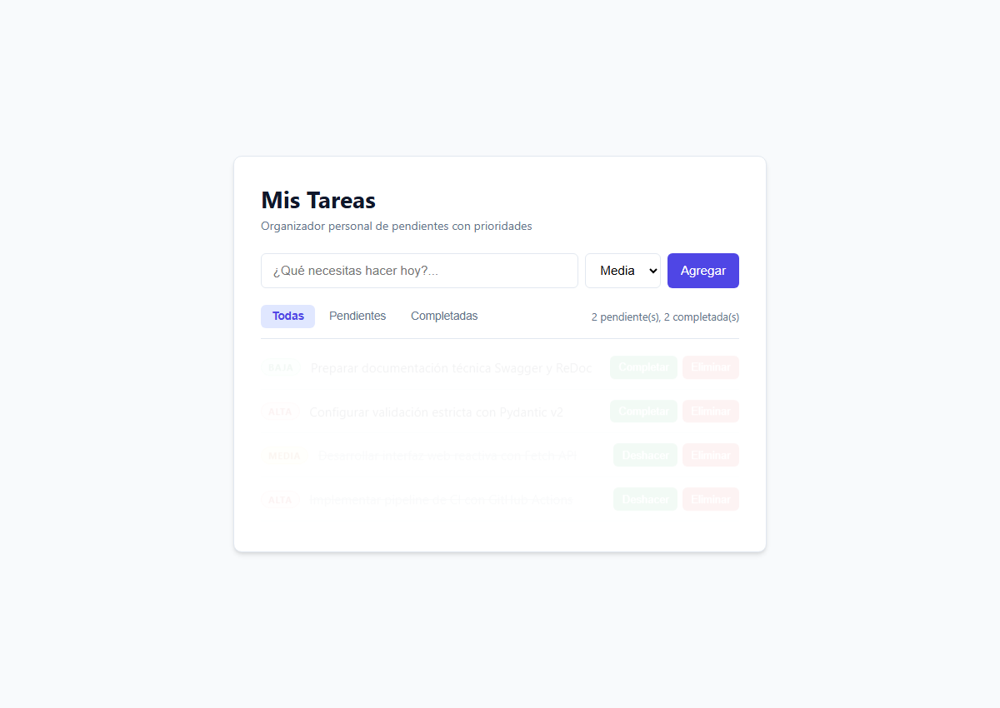

# 📝 To-Do List Web App (FastAPI + Vanilla JS)

**Aplicación web full-stack ligera y reactiva para la gestión de tareas con prioridades y persistencia en SQLite, construida con FastAPI y JavaScript Vanilla.**

[](https://github.com/aledash3/todo-web-fastapi/actions)
[](https://www.python.org/)
[](https://fastapi.tiangolo.com/)
[](https://www.sqlite.org/)
[](https://developer.mozilla.org/es/docs/Web/JavaScript)
[](https://docs.pytest.org/)


---

## 📌 Descripción General

Aplicación web *full-stack* moderna y ligera para la gestión de tareas con prioridades (*Alta*, *Media*, *Baja*). El proyecto implementa una **API REST** asíncrona construida sobre **FastAPI** con persistencia en **SQLite** y un cliente web reactivo desacoplado en **HTML5, CSS3 y JavaScript Vanilla** utilizando Fetch API.

---

## 🖥️ Interfaz de la Aplicación

Vista de la interfaz web reactiva con gestión visual de prioridades, filtrado dinámico por pestañas y contadores en tiempo real:

<p align="center">
  
</p>

---

## ✨ Características Principales

* **CRUD Completo de Tareas**: Crear, listar, actualizar estado/prioridad y eliminar tareas en tiempo real.
* **Sistema de Prioridades**: Clasificación visual en tres niveles (*Alta*, *Media*, *Baja*) con badges estilizados.
* **Filtros en el Cliente**: Pestañas de filtrado dinámico (*Todas*, *Pendientes*, *Completadas*) sin recargar la página.
* **Contador en Tiempo Real**: Métricas visibles de tareas pendientes y completadas.
* **Validación de Datos con Pydantic v2**: Validación estricta en el servidor para evitar títulos vacíos o prioridades inválidas.
* **Documentación Interactiva Automática**: Swagger UI y ReDoc integrados nativamente.
* **Pruebas Automatizadas y CI**: Suite completa de tests con `pytest` y pipeline automatizado con GitHub Actions.

---

## 📂 Estructura del Proyecto

```text
todo-web-fastapi/
├── .github/
│   └── workflows/
│       └── ci.yml             # Pipeline de Integración Continua (Python 3.10, 3.11, 3.12)
├── backend/
│   └── main.py              # API REST, configuración CORS, ciclo lifespan y SQLite
├── database/
│   └── .gitkeep             # Directorio local para tareas.db (ignorado en git)
├── docs/
│   └── assets/
│       └── ui_screenshot.png # Captura de la interfaz web de usuario
├── frontend/
│   ├── index.html           # Estructura semántica accesible
│   ├── styles.css           # Diseño moderno con variables CSS y transiciones
│   └── app.js               # Lógica cliente, Fetch API y renderizado dinámico
├── tests/
│   └── test_tasks.py        # Suite de pruebas unitarias con base de datos aislada
├── agents.md                # Convenciones y contexto del proyecto
├── pyproject.toml           # Configuración de paquete y pytest pythonpath
├── requirements.txt         # Dependencias del proyecto
└── README.md                # Documentación general
```

---

## 🚀 Puesta en Marcha

### Prerrequisitos
* Python 3.10 o superior instalado.
* Navegador web moderno.

### 1. Clonar el repositorio
```bash
git clone https://github.com/aledash3/todo-web-fastapi.git
cd todo-web-fastapi
```

### 2. Crear y activar entorno virtual

**En Windows (PowerShell):**
```powershell
python -m venv venv
.\venv\Scripts\Activate.ps1
```

**En Linux / macOS:**
```bash
python3 -m venv venv
source venv/bin/activate
```

### 3. Instalar dependencias
```bash
pip install -r requirements.txt
```

### 4. Iniciar el servidor backend
```bash
uvicorn backend.main:app --reload
```
El servidor arrancará en `http://127.0.0.1:8000`.

### 5. Abrir la aplicación frontend
Tienes dos formas sencillas de usar la interfaz:
* **Opción A (Recomendada)**: Navega a `http://127.0.0.1:8000/static/index.html` (servida directamente por FastAPI).
* **Opción B**: Haz doble clic en el archivo `frontend/index.html` para abrirlo en tu navegador.

---

## 🧪 Ejecución de Pruebas

El proyecto cuenta con una suite de pruebas automatizadas que utiliza bases de datos temporales aisladas:

```text
============================= test session starts =============================
platform win32 -- Python 3.13.9, pytest-9.1.1, pluggy-1.6.0
rootdir: todo-web-fastapi
configfile: pyproject.toml
testpaths: tests
collected 9 items

tests/test_tasks.py::test_root PASSED                                    [ 11%]
tests/test_tasks.py::test_crear_tarea_exitosa PASSED                     [ 22%]
tests/test_tasks.py::test_crear_tarea_validacion_titulo_vacio PASSED     [ 33%]
tests/test_tasks.py::test_listar_tareas PASSED                           [ 44%]
tests/test_tasks.py::test_filtrar_tareas_por_completitud_y_prioridad PASSED [ 55%]
tests/test_tasks.py::test_toggle_tarea PASSED                            [ 66%]
tests/test_tasks.py::test_actualizar_tarea_con_cuerpo PASSED             [ 77%]
tests/test_tasks.py::test_eliminar_tarea PASSED                          [ 88%]
tests/test_tasks.py::test_tarea_no_encontrada_404 PASSED                 [100%]

======================== 9 passed, 1 warning in 1.31s =========================
```

### Ejecutar Pruebas Localmente
```bash
pytest -v
```

### Integración Continua (GitHub Actions)
Cada `push` o `pull request` en la rama `main` ejecuta automáticamente las 9 pruebas en **Python 3.10, 3.11 y 3.12** sobre máquinas virtuales Ubuntu.

---

## 🔌 Especificación de la API REST

La documentación Swagger interactiva está disponible en: 👉 **`http://127.0.0.1:8000/docs`**

| Método | Endpoint | Descripción | Código Éxito |
| :--- | :--- | :--- | :--- |
| `GET` | `/` | Comprobación de salud y estado de la API | `200 OK` |
| `GET` | `/tasks` | Lista tareas (admite `?completada=bool` y `?prioridad=str`) | `200 OK` |
| `POST` | `/tasks` | Crea una nueva tarea (`titulo`, `prioridad`) | `201 Created` |
| `PUT` | `/tasks/{id}` | Alterna completada o actualiza campos enviados | `200 OK` |
| `DELETE` | `/tasks/{id}` | Elimina una tarea por su ID | `200 OK` |

---

## 👨‍💻 Autores

Este proyecto fue desarrollado de forma colaborativa por:

* **Carlos Alejandro Coronel Quilachamin** — [@AlejandroCoronelWork](https://github.com/AlejandroCoronelWork)
* **David Alejandro Cruz Palacios** — [@aledash3](https://github.com/aledash3)

Carrera de Ingeniería en Ciencias de la Computación  
Asignatura: **Inteligencia Artificial** (6to Semestre)  
**Universidad Politécnica Salesiana (UPS)**  
Quito, Ecuador

---

## 📜 Licencia

Este proyecto fue desarrollado con fines estrictamente académicos y educativos en la **Universidad Politécnica Salesiana (UPS)**.

Todos los derechos reservados conforme a las normativas de desarrollo académico e institucional. Prohibido su uso comercial no autorizado.